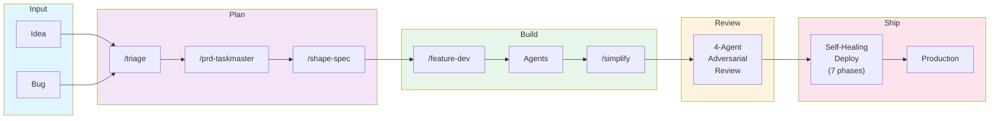

# Agentic SDLC

A public catalog of Claude Code skills, agents, commands, workflow templates, and helper automation for building an end-to-end agentic software delivery lifecycle. The repo is intentionally template-first: private project material has been removed, placeholders are explicit, and the shipped defaults bias toward reviewable, opt-in automation.

## Quick Stats

| Category | Count | Description |
|----------|-------|-------------|
| **Skills** | 24 system + 6 project (in 2 starter packs) | Trigger-matched capabilities (deploy, review, triage, design, orchestration) |
| **Agents** | 4 | Specialized agent definitions (iOS, GCP, dead code) |
| **Commands** | 24 | User-invoked slash commands (agent-os, ops, ios, design-os) |
| **Workflows** | 16 | GitHub Actions (CI/CD, testing, ops, AI automation) |
| **Workflow Helpers** | 10 | Companion `.github/actions`, `.github/scripts`, and drift checks for the workflow templates |
| **Patterns** | 5 | Documented reusable patterns |
| **Plugins** | 25+ | Claude Code marketplace plugins |
| **MCP Servers** | 2 | Tool integrations (Docker recommended, Xcode) |

## Architecture Overview

## Catalog

### Skills (`skills/`)

System-level skills available across all projects:

| Skill | Category | What It Does |
|-------|----------|-------------|
| [self-healing-deploy](skills/system/self-healing-deploy/) | Deploy | 7-phase autonomous merge-to-production pipeline |
| [prd-to-pr](skills/system/prd-to-pr/) | Pipeline | End-to-end PRD to merged PR orchestration |
| [bug-to-pr](skills/system/bug-to-pr/) | Pipeline | End-to-end bug report to fix PR pipeline |
| [pr-handoff-to-codex](skills/system/pr-handoff-to-codex/) | Review | 4-agent adversarial Codex review |
| [prd-taskmaster](skills/system/prd-taskmaster/) | Planning | PRD generation and GitHub issue publishing |
| [triage](skills/system/triage/) | Planning | Batch work item classification and routing |
| [senior-architect](skills/system/senior-architect/) | Architecture | Multi-platform system architecture design |
| [gh-fix-ci](skills/system/gh-fix-ci/) | CI/CD | GitHub Actions failure debugging |
| [code-simplifier](skills/system/code-simplifier/) | Quality | Code clarity and consistency review |
| [dead-code-cleanup](skills/system/dead-code-cleanup/) | Quality | Swift dead code removal in isolated worktree |
| [ios-design](skills/system/ios-design/) | iOS | SwiftUI design system compliance |
| [figma](skills/system/figma/) | Design | Figma-to-code translation via MCP |
| [find-skills](skills/system/find-skills/) | Discovery | Skill discovery and installation |
| [workflow-orchestrator](skills/system/workflow-orchestrator/) | Orchestration | Coordinates multiple pipelines in parallel when the task warrants it |

[Full skills catalog](skills/README.md)

### Agents (`agents/`)

| Agent | Domain | Description |
|-------|--------|-------------|
| [ios-architect](agents/ios/ios-architect.md) | iOS | Senior iOS architect (Swift 6.0+, SwiftUI, MVVM) |
| [ios-developer](agents/ios/ios-developer.md) | iOS | Day-to-day Swift/SwiftUI implementation |
| [dead-code-agent](agents/ios/dead-code-agent.md) | iOS | Dead code detection and removal |
| [gcp-platform-engineer](agents/gcp/gcp-platform-engineer.md) | GCP | Cloud Run, Cloud SQL, Terraform infrastructure |

[Full agents catalog](agents/README.md)

### Commands (`commands/`)

| Suite | Commands | Purpose |
|-------|----------|---------|
| [agent-os](commands/agent-os/) | 5 commands | Standards-driven development framework |
| [ops](commands/ops/) | 7 commands | Cost, performance, and security management |
| [ios](commands/ios/) | 2 commands | iOS build and design |
| [design-os](commands/design-os/) | 10 commands | Product design lifecycle (vision to export) |

[Full commands catalog](commands/README.md)

Design-OS is included because I think the approach is promising, but it is the least battle-tested part of this repo in my own workflow so far.

### Workflows (`workflows/`)

16 GitHub Actions workflows organized by function. The repo also includes the companion `.github/actions/`, `.github/scripts/`, and `Infrastructure/scripts/` helpers referenced by those templates so adopters are not left with broken local-action paths.

| Category | Workflows | Purpose |
|----------|-----------|---------|
| [ci-cd](workflows/ci-cd/) | 6 | Build, deploy, promote (dev -> staging -> prod) |
| [testing](workflows/testing/) | 4 | Backend, iOS, UI, performance tests |
| [ops](workflows/ops/) | 4 | DB migrations, artifact retention, ops review |
| [ai](workflows/ai/) | 2 | Claude bot, AI config hotfix |

[Full CI/CD documentation](docs/ci-cd-catalog.md)

## Key Patterns

### [Adversarial Review](patterns/adversarial-review.md)
4 Codex agents independently review each PR (architecture, security, quality), then an orchestrator synthesizes and autonomously fixes issues.

### [Self-Healing Deploy](patterns/self-healing-pipeline.md)
7-phase pipeline that merges, monitors CI, self-heals failures, runs migrations, applies terraform, and promotes through environments.

### [PRD-to-Production](patterns/prd-to-production.md)
8-step orchestration from PRD to production: generate -> spec -> counsel -> implement -> simplify -> review -> fix -> deploy.

### [Agent-OS Standards](patterns/agent-os-standards.md)
5-command framework that discovers, indexes, and injects project standards into agent context before implementation.

### [Design-OS](patterns/design-os.md)
10-command product design pipeline from vision to export, enforcing sequential design methodology.

This is still an exploratory part of the framework for me. I kept it in the repo because it feels promising, but I have not used it nearly as heavily as the engineering and delivery paths yet.

## Documentation

- [Architecture & Mermaid Diagrams](docs/architecture.md) - 3 detailed workflow maps
- [CI/CD Catalog](docs/ci-cd-catalog.md) - All 16 GitHub Actions documented
- [Package Inventory](docs/package-inventory.md) - npm, pip, MCP server catalog

## Public Hardening

This public version has been scrubbed and hardened for reuse:

- Embedded secrets and private redemption tooling were removed.
- Nested VCS metadata and absolute-path symlinks were removed and ignored.
- The sample Claude Code settings no longer auto-run shell hooks.
- Third-party GitHub Actions are pinned to immutable SHAs.
- Cloud SQL Proxy downloads are checksum-verified.
- The Claude workflow is limited to trusted collaborators instead of arbitrary public commenters.

## Security Note

The `configs/settings/monorepo-fullstack.json` example is a safer baseline for repository analysis and controlled edits. It keeps core Claude file permissions enabled, removes auto-hooks, and only allows a narrow set of local shell reads by default:

- **No auto-enabled shell hooks** - `hooks` is empty by default
- **No network download commands** - `curl`, `wget`, `ssh`, `scp`, `rsync`, and `nc` are explicitly denied
- **No wildcard shell execution** - the example only permits local inspection commands plus `git`

Review and tighten this file to match your own security posture before adoption.

Workflow files use `<YOUR_*>` placeholders and `${{ secrets.YOUR_* }}` names. Replace them with your own project identifiers, secret names, and service accounts before enabling any workflow in production.

## Getting Started

### Adopting Individual Pieces

Each directory is self-contained. To adopt a skill, agent, or command:

1. Copy the directory to your project's `.claude/` folder.
2. Adjust any project-specific references and placeholders.
3. Restart Claude Code to pick up the new configuration.

### Adopting Workflow Templates

These workflows are shipped as a catalog under `workflows/`, not as live `.github/workflows/` files. To use them in your own repo:

1. Copy the workflows you want from `workflows/**` into `.github/workflows/`.
2. Copy the helper directories from this repo:
   - `.github/actions/`
   - `.github/scripts/`
   - `Infrastructure/scripts/`
3. Replace every `<YOUR_*>` placeholder with repo-specific values.
4. Configure the required GitHub Environment secrets and approvals.
5. Dry-run the workflows in a non-production repo before trusting them with real deploy credentials.

### Adopting the Full Pipeline

To replicate the complete agentic SDLC:

1. Install the [superpowers plugin](https://github.com/anthropics/claude-code-plugins) if it fits your workflow.
2. Copy `skills/system/` to `~/.agentConfig/skills/`.
3. Copy relevant `skills/project/` directories into your repo-scoped `.claude/skills/`.
4. Copy relevant `agents/` to your project's `.claude/agents/`.
5. Copy relevant `commands/` to your project's `.claude/commands/`.
6. Start from `configs/settings/monorepo-fullstack.json`, then tighten it further.
7. Treat `hooks/session-init.sh` as an opt-in template and only enable it after review.
8. Adapt the workflow templates and helper actions/scripts for your CI/CD environment.
9. Configure MCP servers per `docs/package-inventory.md`.

## Origin

This catalog was extracted from real production usage across a mobile + cloud monorepo and then generalized into reusable templates. The goal is to preserve realistic patterns without shipping private infrastructure details, private repo references, embedded secrets, or non-portable local paths.

## Contributing

See [CONTRIBUTING.md](CONTRIBUTING.md) for guidelines on adding new skills, agents, commands, or patterns.

## License

[MIT](LICENSE)
