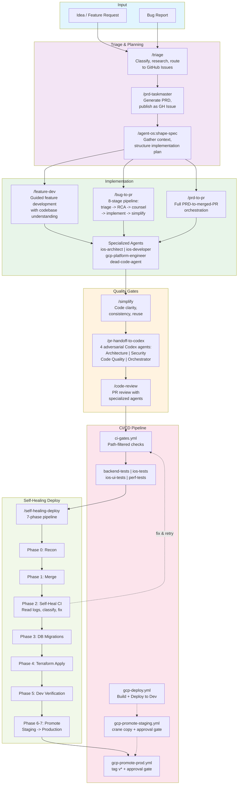
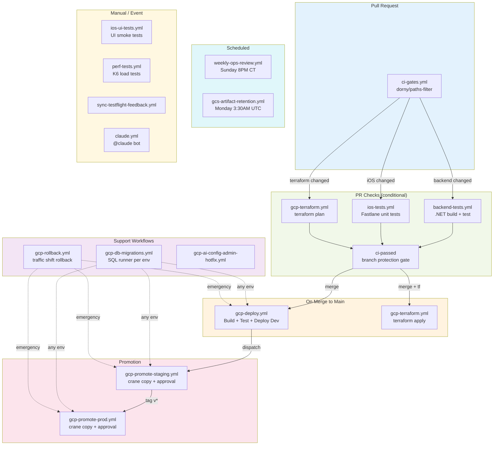

# Architecture & Workflow Maps

Three Mermaid diagrams documenting the end-to-end agentic SDLC.

## 1. End-to-End Agentic SDLC Pipeline

From idea to production, every stage has an agent-driven skill or command.

## 2. Claude Code Tool Ecosystem

How skills, agents, commands, hooks, plugins, and MCP servers connect.

```mermaid
flowchart TB
    CC["Claude Code CLI"]

    subgraph SKILLS["Skills (trigger-matched)"]
        direction TB
        S1["self-healing-deploy"]
        S2["prd-taskmaster / prd-to-pr"]
        S3["bug-to-pr"]
        S4["pr-handoff-to-codex"]
        S5["triage"]
        S6["senior-architect"]
        S7["security-threat-model"]
        S8["gh-fix-ci"]
        S9["code-simplifier"]
        S10["ios-design / dead-code-cleanup"]
    end

    subgraph AGENTS["Agents (dispatched)"]
        A1["ios-architect"]
        A2["ios-developer"]
        A3["gcp-platform-engineer"]
        A4["dead-code-agent"]
    end

    subgraph COMMANDS["Commands (user-invoked)"]
        direction TB
        C1["agent-os/\ndiscover | index | inject\nplan-product | shape-spec"]
        C2["ops/\ncost-optimize | cost-report\nperf-check | perf-optimize\nsecurity-scan | pr-flow"]
        C3["ios/\nios-build | ios-design"]
        C4["design-os/\nproduct-vision | roadmap\ndata-model | design-tokens\ndesign-shell | design-screen\nshape-section | export"]
    end

    subgraph HOOKS["Hooks"]
        H1["Optional SessionStart\nsession-init.sh"]
    end

    subgraph PLUGINS["Plugins (marketplace)"]
        P1["superpowers v5.0.7"]
        P2["frontend-design"]
        P3["pr-review-toolkit"]
        P4["commit-commands"]
        P5["code-review"]
        P6["buildatscale"]
    end

    subgraph MCP["MCP Servers"]
        M1["xcodebuild\niOS builds, simulator"]
        M2["Docker (recommended)\ncontainer ops"]
    end

    CC --> SKILLS
    CC --> AGENTS
    CC --> COMMANDS
    CC --> HOOKS
    CC --> PLUGINS
    CC <--> MCP

    style CC fill:#1a237e,color:#fff
    style SKILLS fill:#e8eaf6
    style AGENTS fill:#e0f2f1
    style COMMANDS fill:#fff8e1
    style HOOKS fill:#fce4ec
    style PLUGINS fill:#f3e5f5
    style MCP fill:#e8f5e9
```

## 3. CI/CD Workflow Dependencies

How the 16 GitHub Actions workflows connect and depend on each other.

