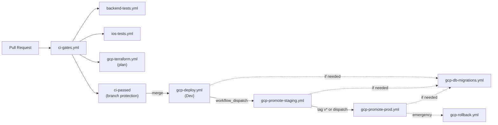

# CI/CD & GitHub Actions Catalog

This document catalogs the GitHub Actions workflow templates shipped with the Agentic SDLC framework. These files live under `workflows/` in this repo and are meant to be copied into `.github/workflows/` in the adopting repository alongside the companion `.github/actions/`, `.github/scripts/`, and `Infrastructure/scripts/` helpers included here.

## Pipeline Overview

## Workflow Catalog

### CI/CD Workflows (`workflows/ci-cd/`)

| Workflow | Trigger | Purpose |
|----------|---------|---------|
| `ci-gates.yml` | `pull_request` to main | Unified PR check entry point. Detects changed paths, dispatches relevant test/plan jobs. Single required status check for branch protection. |
| `gcp-deploy.yml` | `push` to main (backend paths) | Builds .NET backend, runs tests, deploys to Dev Cloud Run. Outputs image digest for promotion. |
| `gcp-promote-staging.yml` | `workflow_dispatch` | Copies tested dev image to staging Artifact Registry via `crane`. Requires GitHub Environment approval gate. |
| `gcp-promote-prod.yml` | `push tags v*` or `workflow_dispatch` | Copies staging image to prod. Requires Environment approval. Supports tag-based or manual trigger. |
| `gcp-rollback.yml` | `workflow_dispatch` | Emergency rollback via Cloud Run traffic shifting to previous revision. Supports dev/staging/prod. |
| `gcp-terraform.yml` | `push` to main (terraform paths) | Applies Terraform changes. PR plans are inlined in ci-gates. Supports per-environment manual dispatch. |

### Testing Workflows (`workflows/testing/`)

| Workflow | Trigger | Purpose |
|----------|---------|---------|
| `backend-tests.yml` | `push` to main, `workflow_call` from ci-gates | .NET build + test + coverage for <YOUR_API_PROJECT>. Called by ci-gates for PRs, standalone for post-merge. |
| `ios-tests.yml` | `push` to main, `workflow_call` from ci-gates | Fastlane-driven iOS unit tests. Xcode 26.3. Called by ci-gates for PRs. |
| `ios-ui-tests.yml` | `push` to main | Non-blocking iOS UI smoke tests. Runs separately from unit tests. |
| `perf-tests.yml` | `workflow_dispatch` | K6 load tests against target environment. Prod restricted to smoke/health read-only scenarios. |

### Operations Workflows (`workflows/ops/`)

| Workflow | Trigger | Purpose |
|----------|---------|---------|
| `gcp-db-migrations.yml` | `workflow_dispatch` | Raw SQL migration runner using `psql`. Transaction-wrapped with `schema_migrations` tracking table. Per-environment auth. |
| `gcs-artifact-retention.yml` | `schedule` (Monday 3:30 AM UTC) | Applies lifecycle retention policies to Cloud Build and run-sources GCS buckets. |
| `weekly-ops-review.yml` | `schedule` (Sunday 8 PM CT) | Collects read-only performance/cost telemetry per environment. Creates parent GitHub issue + deduplicated child issues. |
| `sync-testflight-feedback.yml` | `workflow_dispatch` | Syncs TestFlight feedback and crash reports. Uses PyJWT for App Store Connect API auth. |

### AI/Automation Workflows (`workflows/ai/`)

| Workflow | Trigger | Purpose |
|----------|---------|---------|
| `claude.yml` | trusted collaborator comments | Claude bot integration. Restricted to owner/member/collaborator comments by default and pinned to an immutable action SHA. |
| `gcp-ai-config-admin-hotfix.yml` | `workflow_dispatch` | Applies AI configuration admin hotfixes to staging or production. Environment-gated. |

## Key Patterns

### Build-Once, Promote-by-Digest
Images are built once in `gcp-deploy.yml`, tagged with SHA digest. Promotion workflows (`gcp-promote-staging.yml`, `gcp-promote-prod.yml`) use `crane copy` to move the exact image between Artifact Registries without rebuilding.

### Workload Identity Federation (WIF)
All GCP authentication uses keyless WIF via `google-github-actions/auth`. No service account keys stored as secrets. Requires `id-token: write` permission.

### Companion Helpers
The templates rely on helper assets that are now included in this repo:

- `.github/actions/gcp-project-config`
- `.github/actions/install-crane`
- `.github/actions/setup-xcode`
- `.github/actions/smoke-test`
- `.github/actions/update-api-endpoints`
- `.github/scripts/deploy_cloud_run_service.sh`
- `.github/scripts/check_cloud_run_otel_sidecar.sh`
- `.github/scripts/enforce_artifact_retention.py`
- `.github/scripts/weekly_ops_review.py`
- `.github/scripts/sync-testflight.py`
- `Infrastructure/scripts/check-secret-drift.sh`

If your project does not need a helper, remove the matching workflow step instead of leaving a dead local-action reference behind.

### Environment Approval Gates
Staging and production deployments require GitHub Environment approval. This is configured at the repo level, not in workflow files.

### Concurrency Groups
All workflows use concurrency groups to prevent parallel runs:

- Deploy workflows: `cancel-in-progress: false` (never cancel a deploy)
- Test workflows: `cancel-in-progress: true` (cancel stale PR checks)

### Immutable Action Pins
All third-party actions in the catalog are pinned to commit SHAs rather than mutable tags. Keep them pinned when you upgrade; update both the SHA and the surrounding documentation together.

### Path Filtering
`ci-gates.yml` uses changed-path routing to only run the relevant checks. Backend changes trigger .NET tests; iOS changes trigger Xcode tests; Terraform changes trigger a plan.

### Self-Healing Integration
The `self-healing-deploy` skill (see `skills/system/self-healing-deploy/`) wraps these workflows into a 7-phase autonomous pipeline that can read CI logs, diagnose failures, apply fixes, and re-push.

## Required Secrets & Variables

| Secret/Variable | Used By | Purpose |
|----------------|---------|---------|
| `YOUR_*_GCP_PROJECT_NUMBER` | All GCP workflows | GCP project number per environment (dev/staging/prod) |
| WIF provider string | All GCP workflows | Workload Identity Federation provider (constructed from project number) |
| `YOUR_DEPLOYER_SA` / `YOUR_TERRAFORM_SA` | GCP workflows | WIF service account names |
| `YOUR_ANTHROPIC_API_KEY` | claude.yml | Claude Code API key |
| `YOUR_ASC_*` | sync-testflight-feedback | App Store Connect API credentials |
| `YOUR_PERF_TEST_*` | perf-tests.yml | Performance test credentials |
| `YOUR_APPLE_APP_ID` | sync-testflight-feedback | Apple App Store app identifier |

> **Note:** All secret names are environment-scoped in GitHub. Each environment (dev, staging, prod) has its own set. The `gcp-project-config` helper centralizes placeholder mapping, but adopters still need to replace the placeholder names and validate the resulting workflow permissions.
