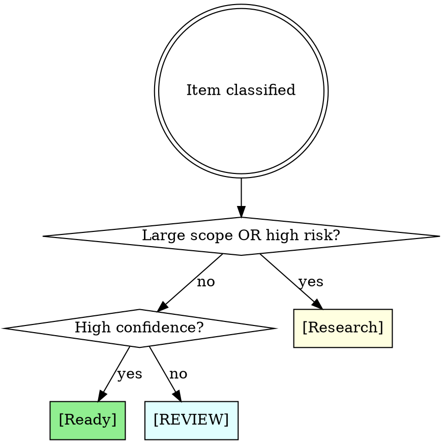

# Triage

## Overview

Batch-process loosely-described work items into properly-routed GitHub issues. Each item is autonomously researched against the codebase, classified by size/confidence/risk, and routed to one of three paths.

## When to Use

- User dumps multiple bugs, features, or ideas in a single message
- Items are loosely described (not full specs)
- Goal is GitHub issues with proper labels and routing

## Decision Routing



| Condition | Path | Action |
|-----------|------|--------|
| Large scope OR high risk (any confidence) | `[Research]` | GH issue with research + suggested `/prd-taskmaster` prompt |
| Small/medium + high confidence | `[Ready]` | Auto-invoke `/agent-os:shape-spec`, GH issue with full spec |
| Small/medium + low/medium confidence | `[REVIEW]` | Spec + open questions section in GH issue |

**Conservative routing**: When uncertain, demote to `[REVIEW]`, never promote to `[Ready]`.

## Orchestration Flow

### Step 1: Parse

Split user message into discrete items. For each:
- Extract raw text
- Generate slug (kebab-case identifier)
- Initial type guess: `bug` (crash/error/broken/fails) or `enhancement` (add/new/create/build)

### Step 2: Research (parallel)

Dispatch one **Explore agent per item** (parallel via Agent tool). Each agent:

1. Search codebase for affected files matching the item description
2. Check `agent-os/standards/index.yml` for applicable standards
3. Check `agent-os/product/roadmap.md` for alignment with planned work
4. Return: affected files list, scope labels, complexity estimate, unknowns

**Prompt template for Explore agents:**
```
Research this work item against the codebase: "{item_text}"

Find:
1. Affected files (search for related code, views, services, controllers)
2. Check agent-os/standards/index.yml for applicable standards
3. Check agent-os/product/roadmap.md for roadmap alignment
4. Estimate: how many files touched, cross-stack (ios+backend)?

Return structured findings:
- Affected files (list paths)
- Scope: ios | backend | ai-services | infrastructure (can be multiple)
- Complexity: trivial (<3 files, single stack) | moderate (3-10 files) | large (10+ or cross-stack)
- Unknowns: what's unclear or needs human input
- Roadmap alignment: does this match planned work?
```

### Step 3: Classify

Using research results, classify each item:

| Dimension | Values | Signals |
|-----------|--------|---------|
| **Size** | small, medium, large | File count, cross-stack scope |
| **Confidence** | high, medium, low | Unknowns count, pattern match clarity |
| **Type** | bug, enhancement | User text keywords, affected code nature |
| **Risk** | low, medium, high | Data model changes, auth/security, cross-stack |

**Classification signals:**

| Signal | Source | Maps to |
|--------|--------|---------|
| crash/error/broken/fails | User text | type=bug |
| add/new/create/build | User text | type=enhancement |
| Swift/SwiftUI/iOS files | Explore | label=ios |
| Controller/.cs/API files | Explore | label=backend |
| Vertex AI/prompt/model | Explore | label=ai-services |
| Terraform/Docker/CI | Explore | label=infrastructure |
| 10+ files or cross-stack | Explore | size=large |
| Data model / migration | Explore | risk=high |
| Auth/security code | Explore | risk=high |
| 3+ unknowns | Explore | confidence=low |

### Step 4: Route

Apply decision matrix:
- Large scope OR high risk (any confidence) -> `[Research]`
- Small/medium + high confidence -> `[Ready]`
- Small/medium + low/medium confidence -> `[REVIEW]`

### Step 5: Execute

Process each item by its assigned path:

**[Ready] path:**
- For moderate+ complexity: invoke `Skill("agent-os:shape-spec", "{item context + research findings}")`, capture the spec output
- For trivial items (< 3 files, obvious fix): write inline spec directly
- Create GH issue:
  ```
  Title: [Ready] {Type}: {Description}
  Labels: {type}, {scope labels}
  Body: Full spec (from shape-spec or inline)
  ```

**[REVIEW] path:**
- Same as [Ready] but append an `## Open Questions` section listing unknowns from research
- Create GH issue:
  ```
  Title: [REVIEW] {Type}: {Description}
  Labels: {type}, {scope labels}
  Body: Spec + Open Questions section
  ```

**[Research] path:**
- Compile research findings into issue body
- Generate a suggested `/prd-taskmaster` prompt the user can run later
- Create GH issue:
  ```
  Title: [Research] PRD: {Description}
  Labels: PRD, {type}, {scope labels}
  Body: Research findings + suggested /prd-taskmaster prompt
  ```

**Create issues with `gh issue create`:**
```bash
gh issue create --title "[Ready] Bug: Audio upload silently fails" \
  --label "bug,ios,backend" \
  --body "$(cat <<'EOF'
  ... spec content ...
  EOF
  )"
```

### Step 6: Report

Output summary table to user:

```markdown
| # | Item | Path | Issue | Labels |
|---|------|------|-------|--------|
| 1 | Podcast player crash | [Ready] | #123 | bug, ios |
| 2 | iMessage sharing | [Research] | #124 | PRD, enhancement, ios |
| 3 | Test prompt button | [Ready] | #125 | enhancement, backend |
| 4 | Audio upload fails | [REVIEW] | #126 | bug, ios, backend |
| 5 | Family history research | [Research] | #127 | PRD, enhancement |
```

## Issue Label Convention

Every issue gets:
- **Type**: `bug` or `enhancement`
- **Scope** (one or more): `ios`, `backend`, `ai-services`, `infrastructure`
- **Priority** (if justified): `priority-high`, `priority-critical`
- **[Research] issues** also get: `PRD`

## Common Mistakes

| Mistake | Fix |
|---------|-----|
| Promoting uncertain items to [Ready] | When in doubt, use [REVIEW] |
| Skipping research phase | Always dispatch Explore agents, even for "obvious" items |
| Creating issues without labels | Every issue needs type + scope labels minimum |
| Running shape-spec for trivial items | Trivial (< 3 files, obvious) gets inline spec |
| Sequential research | Dispatch all Explore agents in parallel |
| Asking user mid-flow | Fully autonomous after parse; unknowns go in [REVIEW] issues |
