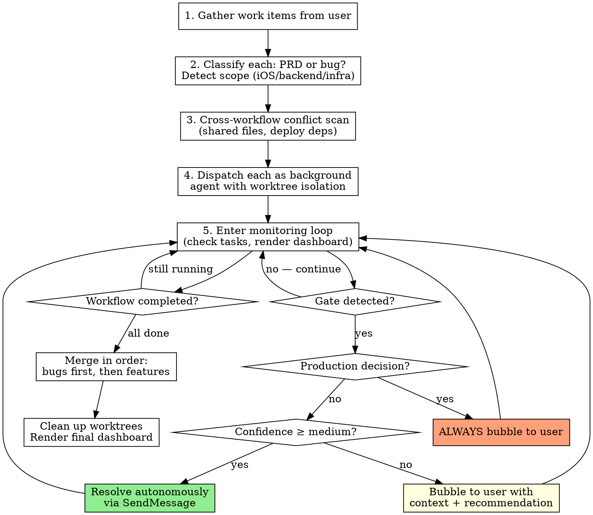
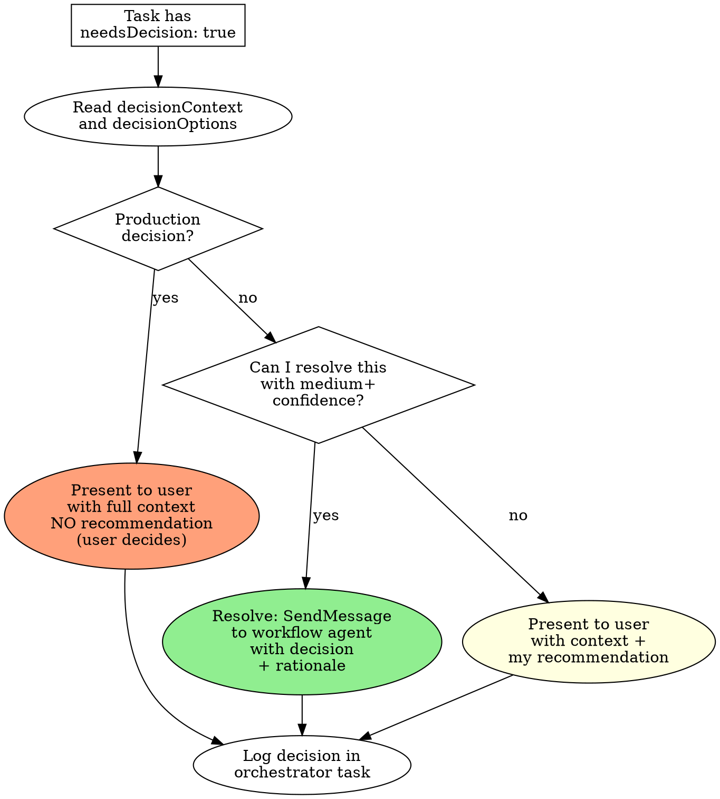

# Workflow Orchestrator

Coordinate multiple `/prd-to-pr` and `/bug-to-pr` pipelines running in parallel, each isolated in its own git worktree, with centralized gate management, observability, and confidence-based autonomous decision-making.

**Core principle:** Orchestrator stays on main. Workflows run in worktrees. Gates move forward — never stall. Decisions route by confidence. All 8 stages run every time.

**Announce at start:** "Using the workflow-orchestrator skill to coordinate N parallel pipelines."

## When to Use

- User has 2+ features (PRDs) or bugs to process end-to-end
- User says "run these in parallel", "batch these", "orchestrate"
- Multiple work items need to ship as a coordinated release
- **NOT** for a single workflow — use `/prd-to-pr` or `/bug-to-pr` directly

## Architecture

```
┌───────────────────────────────────┐
│  ORCHESTRATOR (you)               │
│  • Lives on main branch           │
│  • Foreground — user chats here   │
│  • Monitors all workflows         │
│  • Routes gate decisions          │
│  • Renders status dashboard       │
└─────────┬─────────┬───────────────┘
          │         │
    ┌─────▼───┐ ┌───▼─────┐ ┌─────────┐
    │ Agent 1 │ │ Agent 2 │ │ Agent 3 │
    │ worktree│ │ worktree│ │ worktree│
    │ prd-to- │ │ bug-to- │ │ prd-to- │
    │ pr      │ │ pr      │ │ pr      │
    └─────────┘ └─────────┘ └─────────┘
```

## The Process



---

## Phase 1: Gather and Classify

### 1.1 Collect Work Items

Use AskUserQuestion if not already provided:
- What are the work items? (PRD descriptions, bug reports, issue URLs)
- Which are features vs bugs?
- Any priority order?
- Any dependencies between them?
- Deploy together or independently?

### 1.2 Classify Each Work Item

For each item, determine:
- **Pipeline type**: `/prd-to-pr` or `/bug-to-pr`
- **Scope**: `SCOPE_IOS`, `SCOPE_BACKEND`, `SCOPE_GCP_INFRA` (or combinations)
- **Slug**: Short kebab-case identifier (e.g., `user-profile-sharing`, `fix-auth-race`)
- **Priority**: Order for merge/deploy if dependencies exist

### 1.3 Cross-Workflow Conflict Scan

Before dispatching, identify potential conflicts:

```
For each pair of workflows:
  - Do they touch the same scope? (both backend, both iOS, etc.)
  - Could they modify the same files? (startup files, shared services, migrations)
  - Do they have deploy dependencies? (one requires the other's schema changes)
```

**If shared file conflicts detected:**
- Assign primary ownership to higher-priority workflow
- Lower-priority workflow appends to END of shared files only
- If conflict is severe: serialize those two workflows (dispatch second after first completes)
- **Document all conflicts in a `conflict-matrix` task** so it's visible

### 1.4 Create Master Task List

Create one parent task per workflow, plus orchestrator tasks:

```
TaskCreate: "Orchestrator: Monitor all pipelines"
TaskCreate: "[WF-1] {slug-1} ({prd-to-pr|bug-to-pr}) — Stage 0/8"
TaskCreate: "[WF-2] {slug-2} ({prd-to-pr|bug-to-pr}) — Stage 0/8"
TaskCreate: "[WF-3] {slug-3} ({prd-to-pr|bug-to-pr}) — Stage 0/8"
```

---

## Phase 2: Dispatch Workflows

### 2.1 Dispatch Each as Background Agent with Worktree Isolation

For each workflow, dispatch using the Agent tool:

```
Agent(
  name: "{slug}-pipeline",
  description: "Run {prd-to-pr|bug-to-pr} for {slug}",
  prompt: <see Dispatch Prompt Template below>,
  isolation: "worktree",
  run_in_background: true,
  mode: "bypassPermissions"
)
```

**CRITICAL: All workflows dispatch in a SINGLE message with multiple Agent tool calls.** This ensures true parallelism. Do NOT dispatch sequentially.

### 2.2 Dispatch Prompt Template

Each workflow agent receives a comprehensive prompt containing:

**A. Identity and Pipeline**
```
You are a pipeline executor running {prd-to-pr|bug-to-pr} for: {work item description}

Your pipeline: ALL 8 STAGES ARE MANDATORY. No exceptions. No abbreviations.
```

**B. The Full Pipeline Skill Content**
Include the complete prd-to-pr or bug-to-pr skill content so the agent has the full reference.

**C. Work Item Details**
The PRD text, bug report, issue URL, or whatever the user provided.

**D. Scope and Context**
```
Detected scope: {SCOPE_IOS|SCOPE_BACKEND|SCOPE_GCP_INFRA}
Project CLAUDE.md is at: /path/to/CLAUDE.md (READ IT for build commands)
```

**E. Task Reporting Protocol**
```
TASK REPORTING (MANDATORY at every stage transition):

You have a parent task: {task_id}. Update it at EVERY stage transition:

TaskUpdate(taskId: "{task_id}", subject: "[WF-N] {slug} — Stage {N}/8: {stage_name}",
  metadata: {
    "stage": {N},
    "stageName": "{stage_name}",
    "stageStatus": "in_progress|completed|gate_blocked",
    "needsDecision": false,
    "decisionContext": null
  }
)

When you need a decision you cannot make:
TaskUpdate(taskId: "{task_id}",
  metadata: {
    "stageStatus": "gate_blocked",
    "needsDecision": true,
    "decisionContext": "Clear description of what you need decided and why",
    "decisionOptions": ["option_a description", "option_b description"]
  }
)

Then CONTINUE working on other substeps if possible. Do NOT stop and wait.
```

**F. Gate Autonomy Rules**
```
GATE AUTONOMY — When to decide vs. when to flag:

AUTO-PROCEED (handle yourself):
- Stage 3 Counsel: verdict is APPROVED with no [ISSUE] findings → proceed
- Stage 3 Counsel: verdict is APPROVED with only [SUGGESTION] findings → proceed
- Stage 4 Build: failure with clear error → attempt fix (up to 3 times)
- Stage 6 Codex: timeout → fall back to Generate mode, output prompt
- Stage 7 Copilot: valid suggestions → apply them
- Stage 7 Copilot: no response after 2 min → proceed
- Stage 8 Deploy: dev environment → auto-approve

FLAG TO ORCHESTRATOR (update task with needsDecision: true):
- Stage 3 Counsel: REQUIRES_REWORK verdict
- Stage 3 Counsel: ROOT_CAUSE_REJECTED verdict
- Stage 3 Counsel: amendments that remove or change original requirements
- Stage 4 Build: 3+ consecutive failures
- Stage 7 Copilot: suggestion contradicts requirements
- Stage 8 Deploy: staging environment approval
- Stage 8 Deploy: production environment approval
- Stage 8 Deploy: ANY production failure
- Any error not in the pipeline's error handling table
- Discovery of a different root cause than planned (bug-to-pr only)
```

**G. Cross-Workflow Constraints** (if applicable)
```
SHARED FILE CONSTRAINTS:
- You do NOT own: {list of files owned by other workflows}
- If you need to modify a shared file: APPEND to END only
- Never modify files outside your ownership matrix
```

**H. Strict Adherence Mandate**
```
THE IRON LAW: ALL 8 STAGES RUN EVERY TIME.

If your context compresses mid-pipeline:
1. Read your parent task metadata to find your current stage
2. Read the spec folder artifacts to confirm what stages completed
3. Resume from the next incomplete substep
4. NEVER skip forward. NEVER abbreviate a stage.

Context compression is NOT a shortcut. It is a recovery event.

Red flags — if you think any of these, STOP:
- "This is simple enough to skip counsel" → NO. Run counsel.
- "Simplification isn't needed for this small change" → NO. Run /simplify.
- "Copilot review can be skipped" → NO. Check for review.
- "I already know the root cause, skip analysis" → NO. Write the analysis.
```

---

## Phase 3: Monitor and Manage

### 3.1 The Monitoring Loop

After dispatching all workflows, the orchestrator enters its primary role: **monitoring, deciding, and communicating.**

You will be automatically notified when background agents complete. Between notifications:

1. **Stay responsive to the user.** The user can chat with you at any time. Answer questions, provide status, relay information.
2. **When notified of a completion**, check the result and update the dashboard.
3. **Periodically check task status** when interacting with the user — look for `needsDecision: true` or `gate_blocked` states.

### 3.2 Status Dashboard

Render this dashboard when:
- User asks for status ("how's it going?", "status", "dashboard")
- A workflow completes (success or failure)
- A gate needs user input
- You're providing a natural update

```
╔══════════════════════════════════════════════════════════════════╗
║  Workflow Orchestrator — {N} Active Pipelines                   ║
╠══════════════════════════════════════════════════════════════════╣
║                                                                  ║
║  [1] {slug-1} ({pipeline-type})                                  ║
║      Stage {N}/8: {stage_name} — {detail}                        ║
║      {✓1 ✓2 ✓3 →4 ○5 ○6 ○7 ○8}                                ║
║                                                                  ║
║  [2] {slug-2} ({pipeline-type})                   ⚠ GATE        ║
║      Stage {N}/8: {stage_name} — NEEDS DECISION                  ║
║      {✓1 ✓2 ⚠3 ○4 ○5 ○6 ○7 ○8}                                ║
║      Decision: {brief context}                                   ║
║                                                                  ║
║  [3] {slug-3} ({pipeline-type})                   ✅ DONE        ║
║      Stage 8/8: Complete — PR #{N} merged, deployed to dev       ║
║      {✓1 ✓2 ✓3 ✓4 ✓5 ✓6 ✓7 ✓8}                                ║
║                                                                  ║
╠══════════════════════════════════════════════════════════════════╣
║  Elapsed: {time} │ Gates resolved: {N} │ Pending decisions: {N}  ║
╚══════════════════════════════════════════════════════════════════╝
```

Legend: `✓` = complete, `→` = in progress, `⚠` = gate blocked, `○` = pending, `✗` = failed

### 3.3 Gate Decision Routing

When a workflow reports `needsDecision: true`:



### Confidence Calibration Table

| Situation | Confidence | Action |
|-----------|-----------|--------|
| Counsel APPROVED, no issues | High | Auto-proceed |
| Counsel APPROVED, suggestions only | High | Auto-proceed |
| Counsel REQUIRES_REWORK, technical issues only | Medium | Auto-approve amendments, SendMessage to proceed |
| Counsel REQUIRES_REWORK, requirement changes | Low | Bubble to user |
| Counsel ROOT_CAUSE_REJECTED | Low | Bubble to user — may need rethink |
| Build failure, error is clear (typo, import) | High | SendMessage fix instructions |
| Build failure, error is ambiguous | Medium | Attempt one fix suggestion, flag if fails |
| 3+ consecutive build failures | Low | Bubble to user — something structural |
| Codex review timeout | High | Auto-fallback to Generate mode |
| Copilot suggestion, straightforward fix | High | Auto-apply |
| Copilot suggestion, changes scope | Low | Bubble to user |
| Dev deploy approval | High | Auto-approve |
| Staging deploy approval | Medium | Recommend approval, bubble to user |
| **Production deploy** | **N/A** | **ALWAYS bubble to user** |
| **Production failure** | **N/A** | **ALWAYS bubble to user** |

### 3.4 Handling User Questions About Workflows

When the user asks about a specific workflow:

1. Check task metadata for current state
2. If the workflow agent is still running, report from task data
3. If the user wants to send instructions to a workflow: use `SendMessage(to: "{slug}-pipeline", ...)` to relay
4. If the user wants to cancel a workflow: discuss implications, then stop via task update

### 3.5 Anti-Stall Protocol

**Gates MUST NOT stall.** This is the orchestrator's primary responsibility.

After each user interaction, sweep all workflow tasks:
```
For each workflow task:
  if metadata.stageStatus == "gate_blocked" AND metadata.needsDecision == true:
    → How long has it been blocked?
    → Can I resolve it? (check confidence table)
    → If yes: resolve immediately
    → If no: surface to user NOW (not "later")
```

**The 5-minute rule:** If a gate has been blocked for >5 minutes without action, the orchestrator MUST surface it in the next response to the user, regardless of what the user asked about.

**Never say:** "I'll get back to that." Gates are the #1 priority.

---

## Phase 4: Completion and Merge

### 4.1 Merge Ordering

When workflows complete, merge in this order:
1. **Bug fixes first** (smaller blast radius, may unblock features)
2. **Features by dependency order** (if Feature B depends on Feature A's schema, A merges first)
3. **Independent features in any order**

For each merge:
1. Pull latest main into the worktree branch
2. Resolve any conflicts
3. Run full build verification in the worktree
4. Merge (via the workflow's Stage 8 self-healing-deploy, or manually if deploy is separate)
5. Verify main still builds after merge
6. **Only then** proceed to next merge

### 4.2 Deploy Coordination

If multiple workflows deploy to the same environment:
- Deploy ONE AT A TIME
- Verify health after each deployment
- If a deploy breaks something: stop remaining deploys, investigate

### 4.3 Cleanup

After all workflows complete:
1. Verify all worktrees are cleaned up (Agent tool handles this for successful completions)
2. For failed workflows: report worktree path so user can inspect
3. Render final dashboard with outcomes

### 4.4 Final Dashboard

```
╔══════════════════════════════════════════════════════════════════╗
║  Workflow Orchestrator — COMPLETE                                ║
╠══════════════════════════════════════════════════════════════════╣
║                                                                  ║
║  [1] {slug-1}    ✅ Shipped                                     ║
║      PR #{N} → merged → deployed to {env}                        ║
║      Stages: ✓1 ✓2 ✓3 ✓4 ✓5 ✓6 ✓7 ✓8                          ║
║                                                                  ║
║  [2] {slug-2}    ✅ Shipped                                     ║
║      PR #{N} → merged → deployed to {env}                        ║
║      Stages: ✓1 ✓2 ✓3 ✓4 ✓5 ✓6 ✓7 ✓8                          ║
║                                                                  ║
║  [3] {slug-3}    ⚠ Needs Attention                              ║
║      Stalled at Stage 4 — 3+ build failures                      ║
║      Worktree: {path} (preserved for inspection)                  ║
║      Stages: ✓1 ✓2 ✓3 ✗4 ○5 ○6 ○7 ○8                          ║
║                                                                  ║
╠══════════════════════════════════════════════════════════════════╣
║  Total: {N} shipped, {N} need attention                          ║
║  Gates resolved autonomously: {N}                                ║
║  Gates escalated to user: {N}                                    ║
║  Elapsed: {time}                                                 ║
╚══════════════════════════════════════════════════════════════════╝
```

---

## Loophole Closures

### Orchestrator Self-Recovery

If YOUR (the orchestrator's) context compresses:

1. Run `TaskList` immediately — task metadata is your state recovery mechanism
2. Each workflow task has metadata with `stage`, `stageName`, `stageStatus`, `needsDecision`
3. Rebuild the dashboard from task data
4. Check for any `needsDecision: true` gates — handle them first
5. Resume monitoring

**Do NOT re-dispatch running workflows.** Background agents survive orchestrator context compression. Just recover your awareness of their state.

### Silent Workflow Agent Detection

A workflow agent that stops updating its task metadata may be:
- Dead (crashed, context exhausted)
- Stuck in an infinite loop
- Running fine but forgot to report

**Detection**: If a workflow's task metadata hasn't changed in >10 minutes AND the agent hasn't completed:
1. Attempt `SendMessage(to: "{slug}-pipeline", "Status check: what stage are you on?")`
2. If no response after 2 minutes: treat as dead
3. Re-dispatch from last known stage with worktree isolation

**Prevention**: The dispatch prompt (section E) mandates task updates at EVERY stage transition. This is the safety net.

### User Asks to Skip Stages

The user may say: "Skip counsel for this one" or "We don't need Codex review" or "Just deploy it."

**Response protocol:**
1. Acknowledge the request
2. Explain what the stage catches (briefly, not a lecture)
3. Present the risk: "Stage 3 counsel has caught requirement gaps in N previous runs"
4. If user INSISTS after explanation: comply. The user has final authority.
5. Document the skip in the workflow task metadata: `"skippedStages": [3]`

**The rule is: stages are mandatory BY DEFAULT. Only the user can override, and only after hearing the risk.** You (the orchestrator) may never skip a stage on your own authority.

### Pipeline Content Delivery

**CRITICAL**: Workflow agents are background subagents. They cannot invoke `/prd-to-pr` or `/bug-to-pr` as skills. The Skill tool is not available to subagents.

You MUST include the **full pipeline skill content** in the dispatch prompt. Read the relevant skill file and embed it:

```
For prd-to-pr workflows:
  Read ~/.claude/skills/prd-to-pr/SKILL.md
  Include full content in dispatch prompt

For bug-to-pr workflows:
  Read ~/.claude/skills/bug-to-pr/SKILL.md
  Include full content in dispatch prompt
```

This is non-negotiable. A workflow agent without the full pipeline definition will improvise — and improvisation means skipped stages.

### Adding Workflows Mid-Flight

User may say "add another PRD to the batch" while workflows are running.

1. Classify the new work item
2. Run conflict scan against ALL active workflows (not just the new one)
3. Create a new task for the workflow
4. Dispatch as a new background agent with worktree isolation
5. Add to the dashboard
6. The new workflow runs independently — it doesn't need to "catch up"

### Workflow Produces Unexpected Results

If a completed workflow's output seems wrong (e.g., PR is empty, deploy failed silently):

1. Do NOT merge blindly
2. Check the worktree: `git log`, `git diff main...HEAD` in the worktree
3. Verify artifacts exist (issue URL, plan, counsel log, PR)
4. If anything is missing: flag to user, do not proceed with merge

---

## Error Handling

| Error | Recovery |
|-------|----------|
| Workflow agent dies mid-pipeline | Check task metadata for last stage. Re-dispatch from that stage with `isolation: "worktree"` pointing to existing worktree if possible |
| Worktree creation fails | Check for stale worktrees (`git worktree list`), clean up, retry |
| Two workflows conflict on shared file | Serialize: pause lower-priority workflow until higher-priority merges |
| User disappears during gate decision | Continue resolving auto-approvable gates. Queue user-required decisions. Surface all when user returns |
| Context compression mid-orchestration | Re-read task list to rebuild state. Task metadata is the source of truth |
| Merge conflicts between workflows | Resolve in the later workflow's worktree. Re-verify builds. Then merge |
| Workflow claims stage complete but artifact missing | Reject completion. SendMessage to workflow with "Stage X artifact not found at {path}. Re-run stage X" |
| All workflows hit gates simultaneously | Prioritize: production > staging > dev. Resolve highest-risk gate first |

---

## Red Flags — STOP If You Think These

| Thought | Reality |
|---------|---------|
| "This workflow is simple, skip counsel" | ALL stages mandatory. No exceptions. The skill says so 4 times. |
| "I'll handle this gate later" | Gates are #1 priority. Handle NOW or surface NOW. 5-minute rule. |
| "Let me run these one at a time" | That's not orchestration. Dispatch ALL in parallel in ONE message. |
| "The user doesn't need to know about this" | If confidence < medium, ALWAYS surface it. |
| "I can approve this for production" | Production decisions ALWAYS go to user. No exceptions. |
| "Context is getting long, skip status updates" | Observability is non-negotiable. Render the dashboard. |
| "These workflows don't need worktrees" | NOTHING touches main except the orchestrator. Every workflow gets a worktree. |
| "I'll just work on main and branch later" | Worktree isolation happens at dispatch time. Not "later." |
| "One workflow finished, I can clean up later" | Merge ordering matters. Follow the protocol. |
| "This gate decision is obvious" | Check the confidence table. "Obvious" gates have caused production outages. |

---

## Integration

**Delegates to (via workflow agents):**
- `/prd-to-pr` — Full 8-stage PRD-to-PR pipeline
- `/bug-to-pr` — Full 8-stage bug-to-PR pipeline

**Uses:**
- `Agent` tool with `isolation: "worktree"` and `run_in_background: true`
- `SendMessage` for communicating decisions to running workflows
- `TaskCreate`/`TaskUpdate`/`TaskGet`/`TaskList` for state tracking and observability

**Pairs with:**
- `/triage` — Can be used upstream to classify work items before orchestration
- `superpowers:dispatching-parallel-agents` — Complementary pattern for non-pipeline parallel work

## Quick Reference

| Action | How |
|--------|-----|
| Start orchestration | Gather items → classify → conflict scan → dispatch all in one message |
| Check status | `TaskList` → read metadata → render dashboard |
| Resolve gate | Check confidence table → SendMessage or bubble to user |
| Talk to workflow | `SendMessage(to: "{slug}-pipeline", ...)` |
| Cancel workflow | Discuss with user → update task status |
| Handle completion | Merge in order → verify health → cleanup worktrees |
